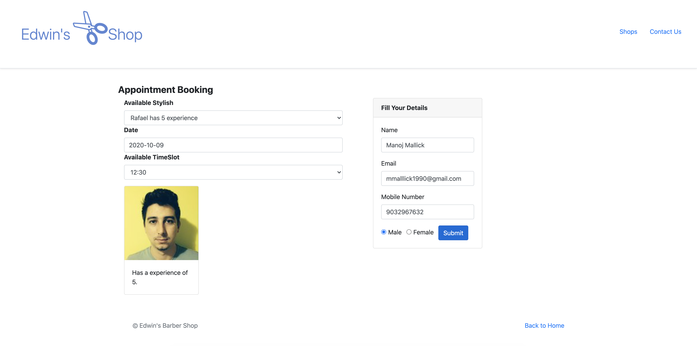

## Barber Shop
```
He wants you to create a booking system that will allow his customers to book an appointment with a barber of their preference. 
he can't really gather any information on customer's satisfaction, send them reminders or collect any other useful metrics to boost his business...
```
With that said, I guess we should start with helping him! We first begin by splitting the work into smaller chunks, because, you know...agile! We then mix in some priority and call them **phases**. So, let's start!
## Motivation
Helping every barber who want him to have a online presence in this competitive world.
## Build status
Build status of continus integration
To be added
## Screenshots




##Live Demo
To be added

## Tech/framework used
<b>Built with</b>
- Java
- Spring Boot
- Spring Framework
- REST
- Swagger
- Docker
- Mongo DB
- Junit
- Mockito
- log4j2

## Features
Helping out all the barbers out there who cannot invest money.(It contains only one part of the full application i.e. API )
#### Phase 1
- In this first phase, the least that we can do is to appoint the customer a barber that is available. Each booking must claim a time slot of 30 minutes.

#### Phase 2
- The customer can either pick a time slot where he will be able to see which barber is available or be able to select a barber and see his schedule. The barbers should be ordered by experience_level. It's up to you what defaults you choose, but hey Edwin does care about the customer journey, or as he likes to call it, "The clever stuff"!

#### Phase 3
- As a customer, I want to receive a reminder 1 hour before my appointment. 

#### Additional Futures
- Shop page is configurable i.e. user shop owner can add more stores(all other entities will work around the shop id)
- Services are added from the api side , but ui its penning
- The user will get email after booking confirmation

### Technical features
- added with swagger support [Host]/api/swagger-ui.html
- added with docker configuration to be deployed to dev and prod
- added 
## Installation
Provide step by step series of examples and explanations about how to get a development env running.

Multiple ways to run the application 
- Docker way

I have created two scripts & two bat files
After in the root 
```
sh ./run-dev.sh   #this is for local dev(port :8088)
sh ./run.sh       #this for prod env(port:8080)

or

chmod +x run.sh
./run.sh

or

./mvnw.cmd clean install
docker-compose -f docker-compose-dev.yml up -d --build

``` 

port can be update by  docker compose file/ .env file in root.

To check the code ide like Intelij or Eclipse , lombok is to be installed 

###Other way

- Java
- Maven
- IDE(optional)


## Credits
Thank you all who like my project. 

#### Anything else that seems useful

## License
MIT © [Manoj Mallick](https://github.com/manojmallick)